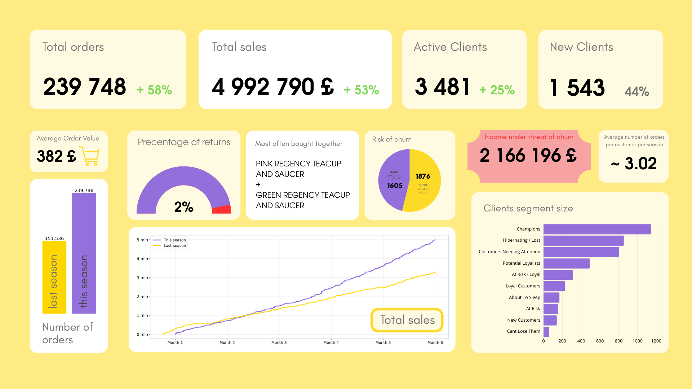
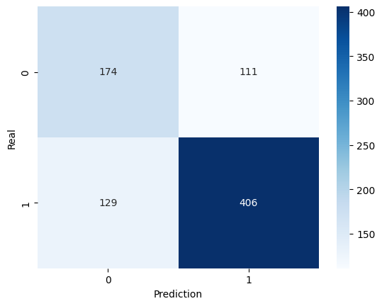
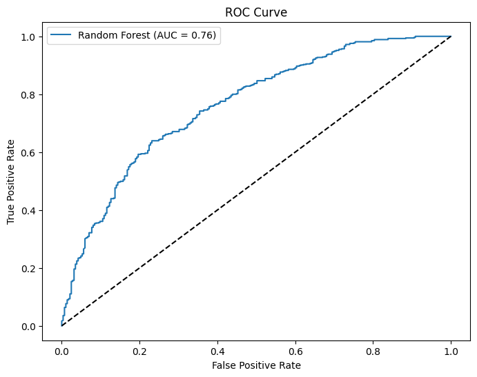

# Retail Analytics & Customer Churn Prediction System

## 1. Project Overview
This repository presents a portfolio-grade analytical project focused on customer behavior analysis and churn prediction in an e-commerce retail context. The project combines descriptive analytics, customer segmentation, association rule mining, and supervised machine learning to deliver business-relevant insights from transactional data.

The analytical scope covers the most recent six-month season available in the dataset, with selected KPIs benchmarked against the preceding six-month period to provide contextual performance evaluation.

The final outcome is a static analytical report supported by a structured set of visual artifacts, designed for clear communication of results to technical and non-technical stakeholders.


---

## 2. Business & Analytical Objectives
The key objectives of this project are to:

- Analyze purchasing behavior using transactional data  
- Segment customers based on value and engagement using RFM methodology  
- Identify product co-purchase patterns through Market Basket Analysis  
- Predict short-term customer churn using a supervised machine learning model  
- Present insights in a concise, executive-ready reporting format  

---

## 3. Technology Stack
- **Language:** Python 3.x  
- **Data Processing & Feature Engineering:** pandas, numpy  
- **Machine Learning:** scikit-learn (Random Forest)
- **Association Rule Mining:** mlxtend (Apriori, Association Rules)  
- **Visualization & Model Diagnostics:** matplotlib, seaborn, plotly, scikit-plot  

---

## 4. Data Source

The dataset used in this analysis was sourced from Kaggle.

**Dataset Name:** Online Retail Data Set

**Author:** Vijaykumar Ummadisetty

**Source Link:** [Link to Kaggle Dataset](https://www.kaggle.com/datasets/vijayuv/onlineretail)

**License:** CC0 1.0 - [Link to License](https://creativecommons.org/publicdomain/zero/1.0/)

---

## 5. Analytical Scope & Methodology

### 5.1 Data Preparation & Exploratory Analysis
The dataset consists of high-volume transactional records (500k+ rows) representing individual purchase events.

The data preparation pipeline includes:

- Data type normalization and missing value handling  
- Removal of non-commercial transactions (e.g. postage, bank charges)  
- Outlier treatment for extreme quantities and unit prices  
- Feature engineering, including:
  - Total transaction value  
  - Average basket value  
  - Return-related behavioral indicators  

---

### 5.2 Customer Segmentation (RFM Framework)
Customer value segmentation was conducted using the Recency–Frequency–Monetary (RFM) model, computed for the most recent six-month period.

- RFM scores were assigned at the customer level  
- Customers were mapped into 10 predefined behavioral segments using rule-based logic  
- Segment-level analysis focused on population size, revenue contribution, and churn exposure  

---

### 5.3 Market Basket Analysis
Market Basket Analysis was implemented using the Apriori algorithm to identify frequent product co-occurrence patterns.

- Transactions were transformed into a basket-level binary matrix  
- Association rules were filtered using support, confidence, and lift thresholds  
- High-lift rules (Lift > 20) were identified within selected product families  

---

### 5.4 Churn Prediction Modeling
A supervised learning model was developed to predict customer churn defined as no purchase activity within 30 days following the observation window.

- **Model:** Random Forest Classifier  
- **Prediction Horizon:** 30 days  
- **Validation Strategy:** Time-based split to prevent data leakage  
- **Class Imbalance Handling:** `class_weight='balanced_subsample'`  

#### Model Evaluation & Error Analysis

**Confusion Matrix**



The model successfully identified 406 true positives (actual churners correctly predicted), achieving a high recall rate which is essential for proactive retention. While 111 false positives were recorded, the business cost of over-targeting active customers is significantly lower than the potential revenue loss from undetected churners.

**ROC Curve**



The ROC curve visualizes the trade-off between the True Positive Rate (Sensitivity) and the False Positive Rate (1-Specificity) across all classification thresholds. The distinct "bow" shape, pulling toward the top-left corner, demonstrates that the model possesses significant discriminative power, effectively separating churners from active customers. With an AUC (Area Under Curve) of 0.76, there is a 76% probability that the model will correctly assign a higher risk score to a randomly chosen churner than to a loyal customer.

---

## 6. Reporting Layer & Dashboard

### Advanced Behavioral Analysis
**Cohort Retention Heatmap**


The initial cohort (2010-12) shows the highest long-term stability with 50% retention after 11 months, while mid-2011 cohorts show sharper early declines. This identifies a seasonal volatility in customer loyalty that requires localized retention interventions.

The dashboard visualizes a 53% increase in seasonal sales alongside a warning that 1,876 clients are currently at high risk of churn. It translates complex machine learning outputs into clear operational KPIs for stakeholders.

---

## 7. Key Results & Business Implications
- The churn model identifies approximately **76% of customers at risk of churn**  
- Predictive targeting delivers a **~3× uplift** compared to random selection  
- A small subset of customer segments contributes to **over 50% of total revenue**, enabling focused retention strategies  

---

## 8. Project Structure

```text
├── data/
│   ├── raw_data.csv
│   ├── cleaned_data.csv
├── notebooks/
│   ├── 01_Data_Cleaning_and_EDA.ipynb
│   ├── 02_Modeling_and_Prediction.ipynb
├── reports/
│   ├── confusion_matrix.png
│   ├── roc_curve.png
│   ├── cohort_heatmap.png
│   └── executive_dashboard.png
└── README.md
